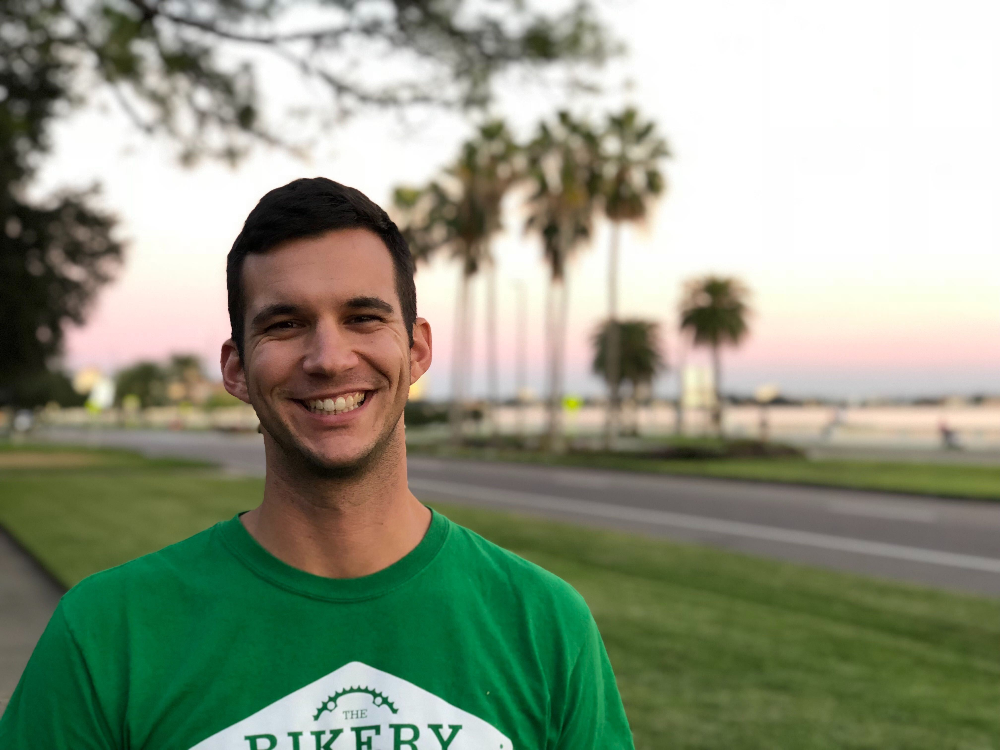

import PressLayout from '../../components/PressLayout'

export default ({ children }) => (
  <PressLayout title="SDG Summer Solstice Hackathon: Celebrating the Resilient Spirit of Developers and Tampa Bay">
    {children}
  </PressLayout>
)

**FOR IMMEDIATE RELEASE: June 4, 2020**

Today, Suncoast Developers Guild (SDG) announced its inaugural Summer Solstice Hackathon to be held virtually from June 19 – 21, 2020. The Academy at Suncoast Developers Guild is a nonprofit software development training school located at 2220 Central Avenue in St. Petersburg. SDG hosts a 2,000+ developer community across the Tampa Bay region.

"Suncoast Developers Guild understands that our vibrant developer community has the ability to tackle pressing challenges for the broader community," said Jason L Perry, CEO of SDG. "The themes selected for this Hackathon are critical current issues such as diversity and response to pandemics. Bringing this area’s developers and designers together in this Hackathon is exciting and will use their creativity to elevate our region," he added.

There are three main themes for the Summer Solstice Hackathon:

### PANDEMIC PREPAREDNESS & RECOVERY

Every day in this region, software developers are solving problems for non-profits, businesses, families, and communities. As COVID-19 has shown us, this recovery depends on solving problems in creative ways. How can we best be prepared for the next pandemic?

### INCLUSION, DIVERSITY, AND INTERSECTIONALITY IN THE TECH WORKFORCE

Yes, Houston, we have a problem. When a workforce does not represent the communities it serves, it causes harm and hampers vibrant solutions. SDG’s is working to change this; come and help us.

### BUILDING A MORE CONNECTED, SMARTER AND INCLUSIVE TAMPA BAY

Developers understand both sustainability and problem-solving. Harness our power by solving a Smart City challenge that will elevate us all. Can we build the Internet of Things (IoT) and Smart City solutions that help our region’s residents without hurting their privacy?

For those new to the Hackathon concept, a Hackathon usually occurs over a weekend or even a week, and participants are given a "challenge" or can pick from several "challenges." The challenge tends to be a problem of local importance or of a very intriguing nature where many skills and creativity in problem-solving is demonstrated. Teamwork is strongly emphasized and multiple approaches to the "challenge" are presented by participating teams or solo devs at the end of the Hackathon. Participants of all skill levels, and a variety of backgrounds, are encouraged to participate. Judges for the SDG Summer Solstice Hackathon will award cash prizes of $1,000 for best team and $750 for runner-up team solutions; a \$250 cash award is for the best solo solution.

"Hackathons can yield kernels of a viable solution and companies sometimes start-up to translate these ideas into reality. We’re really hoping to showcase an enormous amount of creative power through the Hackathon process," added Perry.

<!-- 

  

  

  

> QUOTE
>
> &mdash; **FROM SOMEONE**, SOMEWHERE

  

 -->

To register, check out the schedule of events, become an event co-sponsor, or to learn more about the inaugural Summer Solstice Hackathon, please visit https://hack.suncoast.io or contact us at hello@suncoast.io.

The Summer Solstice Hackathon is powered by Tapp Network, a digital marketing and technology firm serving purpose-driven organizations. The event is also made possible in collaboration with:

- St. Pete Economic Development Corporation
- St. Pete Chamber of Commerce
- St. Pete Innovation District
