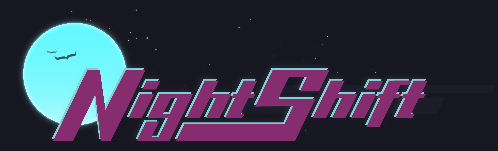

import PressLayout from '../../components/PressLayout'

export default ({ children }) => (
  <PressLayout title="St. Pete’s Coding Academy to Offer Night Classes">
    {children}
  </PressLayout>
)

**FOR IMMEDIATE RELEASE: October 16, 2020**

# St. Pete’s Coding Academy to Offer Night Classes

**St. Petersburg, Florida**&ndash; Suncoast Developers Guild (SDG) is excited to announce its new [**Night Shift** program](https://suncoast.io/academy/night-shift/), a flexible part-time evening course that trains students in programming and web development. In response to increased interest, the new classes will allow SDG to offer an alternative schedule with increased accessibility for students who cannot commit 12 weeks to the full-time Immersive program. By extending the program with part-time after-hours classes, students can begin their journey in coding without having to leave their current job first.

While boredom is the primary reason cited for people wanting to leave their jobs, a growing number are leaving in search of higher pay. For those looking to change careers, the challenge of training for a new industry can be daunting. A career in technology could be the solution as an ever-evolving, high-paying field. Suncoast Developers Guild is here to prepare students for this transition on a schedule that works for them.

Despite the economic impact of the COVID-19 pandemic, major tech companies and startups are still looking for highly skilled coding professionals. According to a survey by Indeed, 84% of companies agree that boot camp graduates are as likely to be top performers and just as prepared, if not more so, to succeed than their counterparts with a college degree[^1].

SDG emerged as the leading hub for tech education and community engagement in 2015. As Florida’s only non-profit immersive code school, the Academy at Suncoast Developers Guild launched in 2018 to provide students the state-of-art technical and soft skills needed to pursue rewarding careers as programmers. The Academy is currently enrolling for both certificate programs. The next 12-week full-time Immersive course begins on January 4, 2021. The Night Shift program will begin on December 8, 2020, and will last for 36 weeks. The new evening classes will be held two nights per week and delivered exclusively online.

Suncoast Developers Guild recognizes that the lingering pandemic has touched everyone’s life in one way or another and is there to help find solutions. SDG offers alternative financing options, as well as scholarships. For more information about courses and registration, visit https://suncoast.io.

[^1]: https://www.indeed.com/lead/what-employers-think-about-coding-bootcamp
